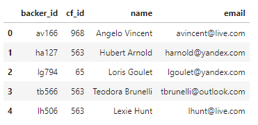

# Crowdfunding-ETL
In this crowdfunding ETL project, I was given an entire dataset of crowdfunding projects, list of contacts and backers that took part of the crowdfunding projects. For this challenge, I was wasked with extracting the backers data and transforming those data into a readable/proper state and then loading the data into SQL for data analysis. 

# Results
I was provided a csv file containing backers_info where backer's name, email, cf_id, and backers_id was provided all in one column. 
For the "Extract" phase, I used jupyter notebook and imported the data into a dataframe. Then I used the Python dictionary method to extract the "backer_id", "cf_id", "name", and "email" from the large column of data and stored the collected data into a new dataframe in their respective columns. Here is the result: 

Next, for the "Transform" phase, I split the name column into "first_name" and "last_name" column, then dropped the "name" column. And re-ordered the columns to have the data look proper. Lastly, I exported this dataframe into a new csv file namely "backers.csv". Here is the link to the file: .

Lastly, for the "Load" phase, I loaded created a table to hold the backers data and made sure the primary, foreign keys are specified and all the proper connections with other tables present. Using all the imported tables, I ran some queries to gather specific data for analysis. Using those queries, I created a new tables for those data and export them into csv files. Those files are  and .
